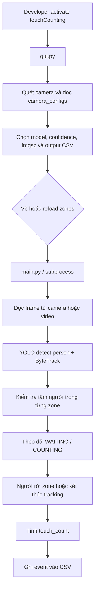

# Touch Counting

Ứng dụng phát hiện và theo dõi người trong vùng quan sát bằng YOLO, sau đó quy đổi thời gian ở trong zone thành số lượng touch và ghi kết quả vào CSV.

## 1. Yêu cầu môi trường

- Windows 10/11.
- Anaconda hoặc Miniconda đã được cài và lệnh `conda` chạy được trong PowerShell.
- Camera USB hoặc nguồn video/RTSP phù hợp.
- Đủ dung lượng cho các model YOLO trong repo và environment được đóng gói.

Repo hiện không có `environment.yml`, vì vậy environment cần được tạo từ `requirements.txt`.

## 2. Cài đặt environment developer

Mở PowerShell tại thư mục repo:

```powershell
cd C:\Users\<username>\Downloads\touch_counting

# Tạo environment đúng tên mà script đóng gói sử dụng
conda create -n touchCounting python=3.11 -y

# Activate đầy đủ trước khi cài package hoặc chạy project
conda activate touchCounting

# Cài dependency của project
python -m pip install --upgrade pip
python -m pip install -r requirements.txt

# Cài công cụ đóng gói environment thành ZIP
conda install -n touchCounting -c conda-forge conda-pack -y
```

Mỗi terminal mới cần chạy lại:

```powershell
conda activate touchCounting
```

Kiểm tra nhanh environment đang được dùng:

```powershell
conda env list
python --version
python -c "import cv2, yaml, portalocker, ultralytics; print('touchCounting is ready')"
```

Nếu PowerShell chưa nhận `conda`, chạy `conda init powershell`, mở lại PowerShell rồi chạy lại `conda activate touchCounting`.

## 3. Chạy ứng dụng trong lúc phát triển

Sau khi đã activate environment:

```powershell
conda activate touchCounting
python .\gui.py
```

GUI sẽ quét camera, hiển thị preview, cho phép chọn model/tham số tracking, cấu hình zone và bắt đầu tracking.

Có thể chạy engine trực tiếp để kiểm tra hoặc xử lý video không cần GUI:

```powershell
conda activate touchCounting

# Liệt kê camera
python .\main.py --list-cameras

# Chạy camera index 0 và mở preview
python .\main.py --camera 0 --config .\config.yaml --output .\events.csv --preview

# Chạy file video và lưu video đã vẽ bounding box/zone
python .\main.py --video .\input.mp4 --config .\config.yaml --output .\events.csv --save-video .\output.mp4
```

## 4. Cấu trúc repo

```text
touch_counting/
├─ gui.py                    # GUI chính: camera, preview, settings, start/stop
├─ main.py                   # Engine YOLO tracking và ghi kết quả CSV
├─ draw_zones.py             # Công cụ vẽ zone bằng OpenCV
├─ config.yaml               # Model và zone mặc định
├─ camera_configs/           # Tên/cấu hình riêng theo từng camera
├─ yolo26n.pt                # Model Nano, nhanh nhất
├─ yolo26s.pt                # Model Small, cân bằng
├─ yolo26m.pt                # Model Medium, chính xác hơn nhưng chậm hơn
├─ logo/                     # Tài nguyên logo của GUI
├─ requirements.txt          # Python dependencies
├─ pack_portable.ps1         # Đóng gói Conda environment và repo thành ZIP
├─ run_portable.bat          # Khởi động bản portable
└─ HUONG_DAN_SU_DUNG.md      # Hướng dẫn cho người dùng cuối
```

## 5. Flow xử lý sơ bộ



Luồng tính toán chính:

1. `main.py` đọc frame và chạy YOLO chỉ cho class `person`.
2. ByteTrack giữ `track_id` giữa các frame; cơ chế grace/distance hỗ trợ khi ID bị đổi tạm thời.
3. Khi tâm bounding box đi vào zone, visit bắt đầu ở trạng thái `WAITING`.
4. Sau `dwell_seconds`, visit chuyển sang `COUNTING`.
5. Khi người rời zone hoặc tracking kết thúc, event được ghi vào CSV.
6. Công thức: `touch_count = thời gian trong zone (phút) x offset (touches/min)`.

## 6. Cấu hình zone và tracking

`config.yaml` chứa các thông số dùng chung:

```yaml
model: yolo26m.pt
confidence: 0.25
imgsz: 640
tracker: bytetrack.yaml
dwell_seconds: 5.0
id_switch_grace_seconds: 1.0
id_switch_distance_pixels: 120.0
regions:
  - name: region_A
    offset: 1.0
    points: [[401, 295], [624, 295], [624, 546], [401, 546]]
```

Có thể dùng nút **Draw / edit zones** trong GUI hoặc chạy trực tiếp:

```powershell
conda activate touchCounting
python .\draw_zones.py --camera 0 --config .\config.yaml
```

Trong cửa sổ vẽ:

- Kéo chuột để tạo zone.
- Nhấn `u` để xóa zone cuối.
- Nhấn `s` để lưu.
- Nhấn `q` hoặc `Esc` để thoát không lưu.

`offset` là hệ số touch/phút riêng của zone. Các file trong `camera_configs/` lưu cấu hình theo định danh camera do GUI nhận diện.

## 7. Tạo file ZIP portable

### 7.1. Điều kiện trước khi đóng gói

Phải activate đúng environment `touchCounting` và đã cài `conda-pack` trong environment đó:

```powershell
conda activate touchCounting
conda-pack --version
```

### 7.2. Đóng gói

Chạy từ root của repo:

```powershell
conda activate touchCounting
powershell -ExecutionPolicy Bypass -File .\pack_portable.ps1
```

Script sẽ:

1. Dùng `conda-pack -n touchCounting` để tạo environment Python thành `environment.zip`.
2. Copy `environment.zip`, source code, model `.pt`, `config.yaml`, `camera_configs/` và `logo/` vào thư mục staging.
3. Tạo file `touch_counting_portable.zip` tại root repo.
4. Tự dọn thư mục staging tạm sau khi hoàn tất.

Nếu đóng gói thành công, terminal sẽ in đường dẫn và kích thước file ZIP. Kiểm tra output:

```powershell
Get-Item .\touch_counting_portable.zip
```

Không đổi tên environment Conda. Tên `touchCounting` được hard-code trong `pack_portable.ps1`.

## 8. Kiểm tra bản portable

Sau khi tạo ZIP:

1. Giải nén `touch_counting_portable.zip` vào một thư mục mới.
2. Đảm bảo `run_portable.bat` và `environment.zip` nằm cùng cấp.
3. Chạy `run_portable.bat`.
4. Lần chạy đầu, script sẽ giải nén `environment.zip` thành thư mục `environment` và chạy `gui.py` bằng Python portable đi kèm.

Bản portable không yêu cầu người dùng cuối cài Python, Conda hoặc package. Không xóa thư mục `environment` sau lần chạy đầu.

## 9. Kết quả và troubleshooting nhanh

- Mặc định GUI ghi kết quả vào `Desktop\events.csv`.
- Một dòng CSV tương ứng với một visit hợp lệ của một người trong một zone.
- Nếu không thấy camera: đóng ứng dụng khác đang dùng camera, nhấn **Refresh**, rồi thử lại.
- Nếu không có event: kiểm tra zone, `dwell_seconds`, đường dẫn CSV và quyền ghi.
- Nếu chạy chậm: chọn model Nano hoặc giảm `imgsz`.
- Nếu ZIP lỗi khi tạo: kiểm tra `conda activate touchCounting`, `conda-pack --version` và dung lượng ổ đĩa.
- Nếu portable không mở: giải nén toàn bộ ZIP, không chạy trực tiếp bên trong file ZIP và kiểm tra `environment.zip` còn nguyên.

Chi tiết thao tác cho người dùng cuối nằm trong [HUONG_DAN_SU_DUNG.md](HUONG_DAN_SU_DUNG.md).